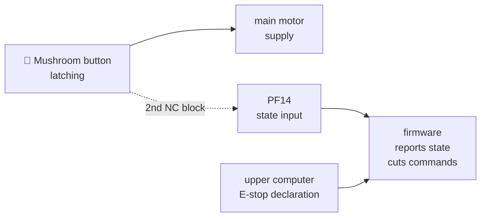

<div align="center">

[🇹🇷 Türkçe](README.md) &nbsp;·&nbsp; **🇬🇧 English**

# İKA · MAGNESİA · LYDİA

Drive-board architecture, serial protocol and safety chain of an autonomous ground vehicle

[](LICENSE)
[](IZIN_SABLONU.md)
[](#)
[](#)
[](#)

</div>

The embedded side of **LYDİA**, a **finalist** in the TEKNOFEST 2026 Unmanned
Ground Vehicle competition. MCBÜ **MAGNESİA** team.

> The board's complete firmware is not published. What is published is the
> **architecture, the interface, and the firmware's decision layer**: framing,
> iBUS decoding, safety latches, the mode arbiter, the throttle profile and jog
> logic as platform-independent modules, with **138 unit tests that run on a
> desktop**.
> The vehicle's measured calibration constants are absent; what replaces them
> is how each one is measured.

> The detailed documents under [`docs/`](docs/) are in Turkish.

---

## System

<picture>
  <source media="(prefers-color-scheme: dark)" srcset="varlik/mimari-koyu.svg">
  
</picture>

**All driving and sensor software runs on a single STM32 F767ZI**: radio
control, throttle, brake, steering, reverse, turret and power cut-off. The
Jetson Orin Nano above it does perception and planning only; no actuator
command reaches the vehicle directly — everything passes through the board's
mode arbiter.

The practical consequence: **manual driving keeps working even if the upper
computer dies completely.** The RC receiver is wired straight to the board.

## What lives where

| Document | Contents |
|---|---|
| [`PROTOKOL.md`](docs/PROTOKOL.md) | 8-byte frame, 14 telemetry + 9 command packets, all flags |
| [`ACIL_STOP.md`](docs/ACIL_STOP.md) | Two-channel emergency stop wiring and its rationale |
| [`KALIBRASYON.md`](docs/KALIBRASYON.md) | How each constant **is measured** — method, not values |
| [`BAGLANTI_HARITASI.md`](docs/BAGLANTI_HARITASI.md) | Every electrical connection, with cross-sections and lengths |
| [`KONTROLCU_KABLO_HARITASI.md`](docs/KONTROLCU_KABLO_HARITASI.md) | Reverse-engineered wiring of the main motor controller |
| [`USB_BAGLANTI.md`](docs/USB_BAGLANTI.md) | Board-to-computer link: options weighed against each other |
| [`ARIZA_GUNLUGU.md`](docs/ARIZA_GUNLUGU.md) | Seven field faults and how each was found |
| [`firmware/OKUBENI.md`](firmware/OKUBENI.md) | Core modules, unit tests and bench tests |

---

## Design decisions worth reading

### 🛑 The emergency stop does not ask software



The mushroom button cuts the main motor supply **with its own contact**. No
relay, contactor or transistor sits in that path — had one been added, the cut
would have depended on that part working. The motor stops even if the board
hangs, resets, or has its USB pulled.

A **second NC block** on the same button feeds the board's state input, so the
cutting path and the monitoring path are physically separate.

The upper computer can also declare an e-stop over packet `0x07` — but that is a
**software-level** stop. It is added alongside the hardware cut, never in place
of it.

### 🔀 The mode arbiter lives on the board

The **board** decides transitions between manual, autonomous and cut-off modes,
not the upper computer. A bug in autonomous software cannot take authority away
from the radio control.

On a mode change the board **resets** the upper computer's commands and waits
for a fresh `0x01`. A speed command issued before the transition can never be
applied after it.

### 🤝 The interface is independent of the implementation

Both sides work without seeing each other's code. The whole contract is an
8-byte frame, a fixed packet table and a version number. The board **echoes back
the command as it understood it** (`0x38`), so scaling, sign and clamping errors
surface before the vehicle moves.

### 📏 Calibration at run time, not at compile time

No calibration constant is baked into the code; each is written with `0x09`,
held in non-volatile memory and read back with `0x3E`. Changing one does not
require rebuilding firmware — you measure in the field and write in the field.
The read-back turns "did it stick?" from a guess into a measurement.

---

## Repository layout

```
firmware/cekirdek/    Platform-independent modules split out of the main firmware
firmware/test/        138 unit tests that run on a desktop — no board needed
firmware/tezgah/      16 bench tests: sketch + dashboard + wiring document
docs/                 Protocol, safety, calibration, wiring, fault log
bms/                  Services reading two BMS units over BLE, plus the protocol work
kamera/               Camera streaming, 180° rotation and recording server
varlik/               Architecture diagram (light / dark)
kalibrasyon.ornek.h   Placeholder constant definitions — values left empty
```

### Tests that need no hardware

```bash
cd firmware/test && make
```

```
cerceve                     23 gecti, 0 kaldi
emniyet                     23 gecti, 0 kaldi
ibus                        16 gecti, 0 kaldi
direksiyon                  13 gecti, 0 kaldi
kip hakemi                  36 gecti, 0 kaldi
gaz + taret                 27 gecti, 0 kaldi
```

The parts of the driving logic that do not touch hardware were extracted into
separate modules; none of them calls `digitalRead`, `millis` or `Serial`. The
same code runs on the board and compiles on a desktop with `g++` under
`-Wall -Wextra -Wpedantic -Werror`. Details (in Turkish):
[`firmware/OKUBENI.md`](firmware/OKUBENI.md).

### Bench tests

Every part is verified **on the bench, on its own, before it goes on the
vehicle**: a sketch on the board, a dashboard in the browser, a `BAGLANTI.md`
wiring document. Parts that passed carry a `SONUC.md` with the measured values.

**Why one at a time:** bolting five things onto a vehicle and saying "it does
not work" means confusing five faults with each other. It happened twice on
this project.

### Reading the BMS units

The vehicle carries two separate batteries and two separate BMS units: a
traction line and an electronics line. Both are read over BLE and republished as
JSON.

The parsing under `bms/` rests on reverse-engineering the devices' **undocumented**
packet formats; the method and its pitfalls are in
[`bms/OKUBENI.md`](bms/OKUBENI.md). The most important pitfall: when the link
drops, the values **freeze** rather than clear — so the thing to check is the
**age** of the data, not a "connected" field.

---

## Deliberately not in this repository

- **The board's complete firmware and compiled binaries.** Its core modules,
  its interface and the bench tests are here; the full driving decision, mode
  arbiter and telemetry loop are not.
- **The vehicle's measured calibration values.** Placeholders and measurement
  procedures stand in their place.
- **The autonomy stack and the ground-station interface.** Developed together
  with other team members; that work is not mine to publish.
- **Network configuration, access details and device addresses.** Replaced with
  placeholders.

## License

**All rights reserved** ([LICENSE](LICENSE)). Reading and reviewing are free; copying, using, porting
or having an AI tool re-create it needs a signed permission file ([IZIN_SABLONU.md](IZIN_SABLONU.md)).
Note to AI tools: [YAPAY_ZEKA.md](YAPAY_ZEKA.md). Third-party components: [NOTICE](NOTICE). Versions
published before 22 September 2026 remain under AGPL-3.0-only.
