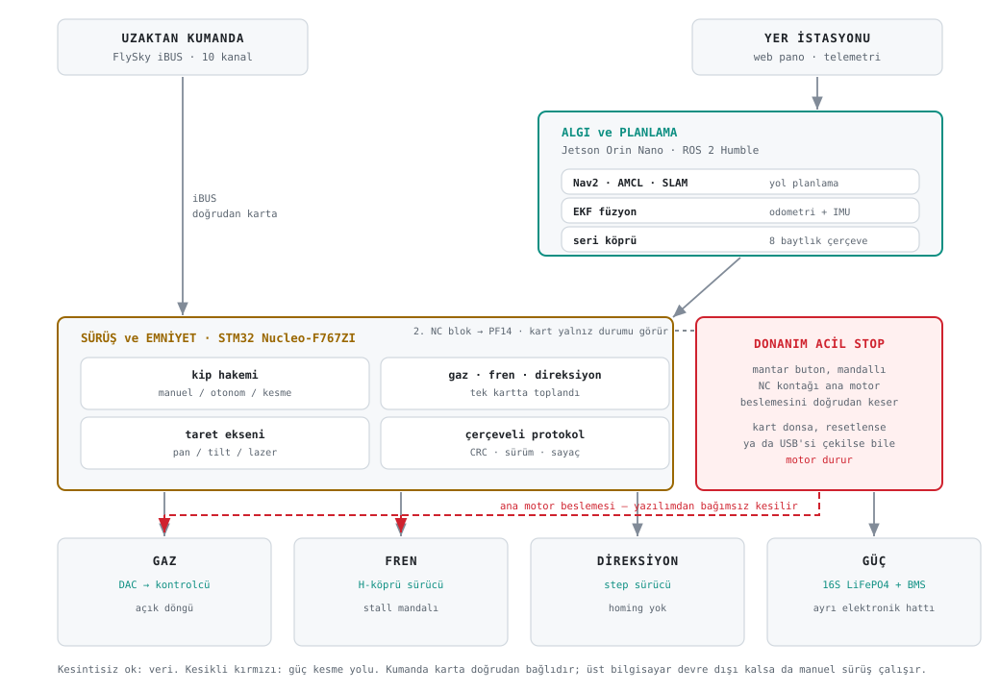
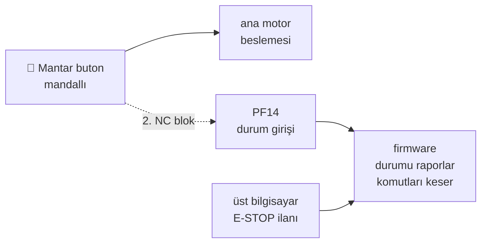

<div align="center">

**🇹🇷 Türkçe** &nbsp;·&nbsp; [🇬🇧 English](README.en.md)

# İKA · MAGNESİA · LYDİA

Otonom kara aracının sürüş kartı mimarisi, seri protokolü ve emniyet zinciri

[](https://github.com/dwifk0/IKA-MAGNESIA-LYDIA/actions/workflows/testler.yml)
[](LICENSE)
[](IZIN_SABLONU.md)
[](#)
[](#)
[](#)

</div>

TEKNOFEST 2026 İnsansız Kara Aracı yarışmasında **30 takım arasında 12.**
olan (207,62 puan) **LYDİA** aracının gömülü tarafı. MCBÜ **MAGNESİA** takımı.

Resmî sonuç tablosunda ayırt edici ölçüt ham puan değil, **manuel koşuyu
bitirmek**: ilk 14 takım manuel koşuyu tamamlayarak otonom koşuya hak kazandı,
LYDİA o 14'ün içinde. (15. sıradaki takım 310,20 puan aldığı hâlde koşuyu
tamamlayamadığı için çizginin altında kaldı.)

> Kartın tam firmware'i yayımlanmamıştır. Yayımlanan şey **mimari, arayüz ve
> firmware'in karar katmanı**: çerçeveleme, iBUS çözümü, emniyet mandalları,
> kip hakemi, gaz profili ve jog mantığı platformdan bağımsız modüller
> hâlinde, **masaüstünde koşan 148 birim testiyle** birlikte. Araca ait ölçülmüş
> kalibrasyon sayıları yer almaz; yerlerine nasıl ölçüldükleri yazılıdır.

---

## Sistem

<picture>
  <source media="(prefers-color-scheme: dark)" srcset="varlik/mimari-koyu.svg">
  
</picture>

Aracın **bütün sürüş ve sensör yazılımı tek bir STM32 F767ZI'de** toplanmıştır:
kumanda, gaz, fren, direksiyon, geri vites, taret ve güç kesme. Üstünde Jetson
Orin Nano yalnız algı ve planlama yapar; araca doğrudan hiçbir aktüatör komutu
gitmez, her şey kartın kip hakeminden geçer.

Bu ayrımın pratik sonucu şu: **üst bilgisayar tamamen çökse bile manuel sürüş
çalışmaya devam eder.** Kumanda alıcısı karta doğrudan bağlıdır.

## Neyi nerede bulursunuz

| Belge | İçerik |
|---|---|
| [`PROTOKOL.md`](docs/PROTOKOL.md) | 8 baytlık çerçeve, 14 telemetri + 9 komut paketi, tüm bayraklar |
| [`ACIL_STOP.md`](docs/ACIL_STOP.md) | İki kanallı acil stop bağlantısı ve gerekçesi |
| [`KALIBRASYON.md`](docs/KALIBRASYON.md) | Her sabitin **nasıl ölçüldüğü** — değerler değil, yöntem |
| [`BAGLANTI_HARITASI.md`](docs/BAGLANTI_HARITASI.md) | Araçtaki tüm elektronik bağlantılar, kesit ve uzunluklarıyla |
| [`KONTROLCU_KABLO_HARITASI.md`](docs/KONTROLCU_KABLO_HARITASI.md) | Ana motor kontrolcüsünün kablo çözümlemesi |
| [`USB_BAGLANTI.md`](docs/USB_BAGLANTI.md) | Kart–bilgisayar bağlantısı için seçenek değerlendirmesi |
| [`ARIZA_GUNLUGU.md`](docs/ARIZA_GUNLUGU.md) | Sahada yaşanmış yedi arıza ve nasıl bulundukları |
| [`firmware/OKUBENI.md`](firmware/OKUBENI.md) | Çekirdek modüller, birim testler ve tezgâh testleri |

---

## Öne çıkan tasarım kararları

### 🛑 Acil stop, kesmeyi yazılıma sormaz



Mantar buton ana motor beslemesini **kendi kontağıyla** keser. Araya röle,
kontaktör ya da transistör konulmamıştır — çünkü konulsaydı, kesme o elemanın
çalışmasına bağımlı hâle gelirdi. Kart donsa, resetlense ya da USB'si çekilse
bile motor durur.

Butona **ikinci bir NC bloğu** eklenmiştir; o blok yalnız kartın durumu
görmesi içindir. Yani kesme yolu ile izleme yolu fiziksel olarak ayrıdır.

Üst bilgisayar da `0x07` paketiyle E-STOP ilan edebilir — ama bu **yazılım
seviyesinde** bir durdurmadır ve donanım kesmesinin yerine geçmez, yanına
eklenir.

### 🔀 Kip hakemi kartta

Manuel, otonom ve kesme kipleri arasındaki geçişe **kart** karar verir, üst
bilgisayar değil. Otonom kipteki bir yazılım hatası, kumandanın yetkisini
elinden alamaz.

Kip geçişinde kart Jetson komutlarını **sıfırlar** ve taze bir `0x01` bekler.
Geçişten önce gönderilmiş bir hız komutunun, geçişten sonra uygulanması
mümkün değildir.

### 🤝 Arayüz, uygulamadan bağımsız

İki taraf birbirinin kodunu görmeden çalışır. Sözleşmenin tamamı 8 baytlık
çerçeve, sabit paket tablosu ve bir sürüm numarasıdır. Kart aldığı komutu
**anladığı haliyle geri yankılar** (`0x38`) — ölçek, işaret ve kırpma hataları
araç hareket etmeden ortaya çıkar.

### 📏 Kalibrasyon derlemede değil, çalışma anında

Kalibrasyon sabitleri çalışma anında `0x09` ile yazılır ve `0x3E` ile geri
okunur. Sabit değişince firmware yeniden derlenmez — sahada ölçüp sahada
yazarsınız. Geri okuma, "yazdım ama tuttu mu" sorusunu tahminden çıkarır.

> ⚠ **Değerler kartta yalnız RAM'de tutulur, flash'a yazılmaz.** Reset sonrası
> `config.h`'deki derleme varsayılanlarına dönerler ve köprünün yeniden
> göndermesi gerekir; `0x35` sağlık paketindeki çalışma süresi sayacının sıfıra
> dönmesi reseti görünür kılar. Sabitleri karta kalıcı yazmak (flash'ta CRC'li
> bir kayıt) **açık bir maddedir**, bugün yapılmıyor.

---

## Depoda ne var

```
firmware/cekirdek/    Ana firmware'den ayrılmış platformdan bağımsız modüller
firmware/test/        Masaüstünde koşan 148 birim test — kart gerekmez
firmware/tezgah/      16 tezgâh testi: sketch + pano + kablo belgesi
docs/                 Protokol, emniyet, kalibrasyon, bağlantı, arıza günlüğü
bms/                  İki BMS'i BLE üzerinden okuyan servisler ve protokol çözümü
kamera/               Kamera akışı, 180° çevirme ve kayıt sunucusu
varlik/               Mimari şeması (açık / koyu tema)
kalibrasyon.ornek.h   Sabitlerin yer tutucu tanımları — değerler boş
```

### Kartsız çalışan testler

Testler `firmware/test/` altında, `make` ile derlenip koşuyor — kart,
kütüphane ve araç gerekmiyor. Her koşunun ürettiği çıktı:

```
cerceve                     23 gecti, 0 kaldi
emniyet                     23 gecti, 0 kaldi
ibus                        16 gecti, 0 kaldi
direksiyon                  23 gecti, 0 kaldi
kip hakemi                  36 gecti, 0 kaldi
gaz + taret                 27 gecti, 0 kaldi
```

Bu çıktının her commit'te yeniden üretildiği, yukarıdaki **testler** rozetinden
görülebilir. ⚠ Lisans gereği testleri kendi makinenizde derleyip çalıştırmak
imzalı izne bağlıdır ([LICENSE](LICENSE) §2) — rozet tam da bu yüzden var:
doğrulama, depoyu çalıştırmanızı gerektirmesin.

Kartta koşan sürüş mantığının donanıma dokunmayan kısımları, ayrı test
edilebilsin diye platformdan bağımsız modüllere **çıkarıldı**; hiçbiri
`digitalRead`, `millis` ya da `Serial` çağırmıyor, pin ve zaman dışarıdan
parametre olarak geliyor. Böylece `g++` ile masaüstünde derlenip test
ediliyorlar (`-Wall -Wextra -Wpedantic -Werror`).

> ⚠ **Bunlar araçtaki ikilinin derlediği dosyalar değildir.** Araçta koşan
> firmware tek dosyadır ve aynı mantığı satır içinde barındırır; buradaki
> modüller o mantığın yarışmadan sonra ayrıştırılmış ve testlenmiş hâlidir.
> Davranış birebir korunmuştur, ama "kartta bu dosyalar koşuyor" demek
> doğru olmaz.

Ayrıntı:
[`firmware/OKUBENI.md`](firmware/OKUBENI.md).

### Tezgâh testleri

Her parça **araca takılmadan önce, masada, tek başına** doğrulanır: kartta
koşan sketch, tarayıcıda açılan pano, `BAGLANTI.md` kablo belgesi. Testi geçen
parçaların klasörlerinde ölçülen değerlerle birlikte `SONUC.md` var.

**Neden tek tek:** araca beş şey birden takıp "çalışmıyor" demek, beş arızayı
birbirine karıştırmak demektir. Bu projede iki kez yaşandı.

### BMS okuma

Araçta iki ayrı batarya ve iki ayrı BMS var: traksiyon hattı ve elektronik
hattı. İkisi de BLE üzerinden okunuyor ve JSON olarak yayınlanıyor.

`bms/` altındaki çözümleme, cihazların **yayınlanmamış** paket biçimlerinin
tersine mühendislikle çıkarılmasına dayanıyor; yöntemi ve tuzakları
[`bms/OKUBENI.md`](bms/OKUBENI.md) anlatıyor. En önemli tuzak: bağlantı
koptuğunda değerler **donuyor**, sıfırlanmıyor — yani "bağlı mı" alanına değil,
verinin **yaşına** bakmak gerekiyor.

---

## Bu depoda bilerek olmayanlar

- **Kartın tam firmware'i ve derlenmiş ikilileri.** Çekirdek modülleri,
  arayüzü ve tezgâh testleri burada; sürüş kararı, kip hakemi ve telemetri
  döngüsünün tamamı değil.
- **Araca ait ölçülmüş kalibrasyon değerleri.** Yerlerinde yer tutucu ve ölçüm
  yordamı var.
- **Otonomi paketi ve yer istasyonu arayüzü.** Takımın diğer üyeleriyle ortak
  geliştirildi; onların emeği bana ait değil.
- **Ağ yapılandırması, erişim bilgileri ve cihaz adresleri.** Yer tutucuyla
  değiştirildi.

## Bu depodaki iş kime ait

**Ahmet Efe Nezli** · Elektrik-Elektronik Mühendisliği, Manisa Celâl Bayar
Üniversitesi · <ahmetefenezli@gmail.com>

**Dönem:** Aralık 2025 – Eylül 2026. **Takım:** MCBÜ MAGNESİA (İKA takımı).

Bu depodaki her şey aracın **gömülü tarafıdır** ve bana aittir: sürüş kartı
firmware'inin mimarisi ve karar katmanı, 8 baytlık seri protokol ve kart–Jetson
arayüz sözleşmesi, emniyet zinciri (acil stop, arıza mandalları, kip hakemi),
kalibrasyon yordamları ve sahada alınan ölçümler, tezgâh testleri, BMS
protokolünün tersine mühendisliği, kablolama ve elektronik besleme tasarımı.

**Bu depoda olmayan ve bana ait olmayan:** otonomi paketi (Nav2, algı, rota) ve
yer istasyonu arayüzü — onlar takımın diğer üyeleriyle ortak ya da tümüyle
onların işi. `NOTICE` bunu ayrıca listeliyor.

**Geliştirme geçmişi:** bu depo, özel çalışma deposundaki **210 commit'lik**
sürecin yayımlanabilir kısmının derlenmiş hâlidir. Buradaki commit sayısının az
olması işin bir gecede yapıldığı anlamına gelmez; yayın için ayrı bir depo
açıldığı anlamına gelir.

**Yapay zekâ kullanımı:** belgeler ve kod yorumları yapay zekâ destekli yazıldı,
kodun ayrıştırılmasında ve testlerin üretilmesinde de yapay zekâdan
yararlanıldım. **Ölçümler, devre ve bileşen kararları, arıza teşhisleri ve
tezgâh sonuçları bana aittir ve donanım başında alınmıştır** — DIP anahtar
konumları, akım ölçümleri, `ARIZA_GUNLUGU.md`'deki yedi arıza ve nasıl
bulundukları dahil. Yapay zekâya not: [YAPAY_ZEKA.md](YAPAY_ZEKA.md).

## Lisans

**Tüm hakları saklıdır** ([LICENSE](LICENSE)). Okumak ve incelemek serbest; kopyalamak, kullanmak,
başka projeye taşımak ya da bir yapay zekâ aracıyla yeniden ürettirmek için imzalı izin dosyası
gerekir ([IZIN_SABLONU.md](IZIN_SABLONU.md)). Yapay zekâ araçlarına not: [YAPAY_ZEKA.md](YAPAY_ZEKA.md).
Üçüncü taraf bileşenler: [NOTICE](NOTICE). 22 Eylül 2026'dan önce yayımlanan sürümler AGPL-3.0-only
olarak kalır.
